# MachineLearningTechniques
My Notebooks for Machine Learning Techniques (by @hsuantien)

---

### 目录

---

### Coursera Links

- [机器学习基石上 (Machine Learning Foundations)-Mathematical Foundations](https://www.coursera.org/learn/ntumlone-mathematicalfoundations)
- [机器学习基石下 (Machine Learning Foundations)-Algorithmic Foundations](https://www.coursera.org/learn/ntumlone-algorithmicfoundations)
- 机器学习技法（已下架，请移步油管或其他资源）
- [机器学习基石 Notebooks](https://github.com/chAwater/MachineLearningFoundations)
- by [Hsuan-Tien Lin](https://www.csie.ntu.edu.tw/~htlin/)

### 前言介绍

《机器学习技法》是国立台湾大学资讯工程系的 **林轩田** 老师开设的课程（**中文授课**）。

该课程旨在延续《机器学习基石》，包括机器学习的 **哲学**、关键 **理论** 和核心 **技术** 。

《机器学习技法》更进一步的关注在 **特征转换** 的一些相关技术，让学生能够更专业的了解和使用机器学习。

- 需要先学习《机器学习基石》（下简称《基石》）再学习《机器学习技法》

### 其他支持

- [ Atom](https://atom.io)
- [CodeCogs (LaTeX Editor API)](http://latex.codecogs.com)
- [Grip -- GitHub Readme Instant Preview](https://github.com/joeyespo/grip)
- [Markdown Toc](https://github.com/nok/markdown-toc)

---

## Lecture 1: Linear Support Vector Machine

—— 介绍边界的概念

—— 介绍支持向量机、名字的由来

—— 介绍支持向量机的一般解法和理论保证

### 最大边界的线性分类器

先回顾一下线性分类问题（参见《基石》）：
- 
<!-- - =\mathrm{sign}\(\mathbf{w}^T\mathbf{x}\)) -->
- PLA 算法

但是对于一些问题，可能存在多种 PLA 的解都可以把数据分开，得到的解取决于把数据放入 PLA 算法的顺序，并且这些解看上去“一样好”！

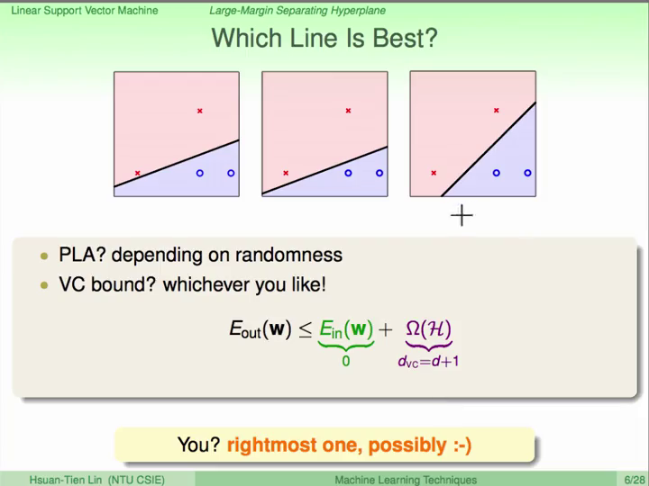

但是我们 **人类** 会倾向于选择最右边的这个，这是因为当存在一些`噪音`的时候（比如测试数据和训练数据之间存在一些误差）最右边的这个线可以容忍最多的噪音、误差。

所以，我们希望 **每个点都和我们的线距离最远**，也可以说我们希望我们能够找到一个 **最胖** 的线，这个线离它最近的点的距离最远。
这个线有多“胖”，就是说这个线的 **边界 (margin)** 有多大。

总结一下：
- 找到一个可以正确区分数据的线性分类器（超平面）
- 得到每个数据和这个线性分类器的距离，取最小的距离作为边界
- 最大化这个边界

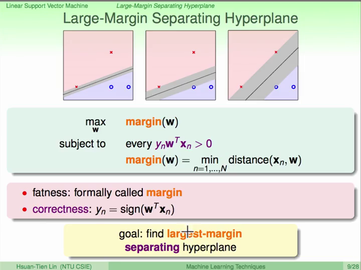

### 简化问题

首先，需要把线性分类问题中的 <b>w</b><sub>0</sub> 单独拿出来讨论，称之为 <i>b</i>，并把 <b>x</b><sub>0</sub> 从原先的 <b>x</b> 中去掉：

<!-- =\mathrm{sign}\(\mathbf{w}^T\mathbf{x}%2Bb\)) -->

---

[Issues #1] 为什么要把 b 拿出来？

---

#### 简化距离

对于每个数据点和分类器（超平面）之间的距离：
- 考虑超平面上的任意一点 x<sup>'</sup>
- **w** 与超平面上任意一点的乘积为 0 ，因此 **w** 相当于超平面的法向量（）
<!-- （） -->

- 数据点和超平面的距离，相当于数据点和连接的向量在垂直于超平面方向（ **w** ）上的投影
- 因为这数据点可以被分类器（超平面）区分，因此有 y<sub>n </sub>(<b>w</b><sup><i>T</i></sup><b>x</b><sub>n</sub> + <i>b</i>) > 0

所以距离可以简化为：


#### 简化条件 - 向量缩放和边界的定义

对于表示这个分类器（超平面）的向量来说，向量的缩放（改变长度不改变方向）并不影响，仍然可以表示这个超平面。

因此，我们可以对这个向量进行一个 **特殊的缩放**，使：


这样操作之后有两个好处：
1. 显然在这种缩放下可以保证 y<sub>n </sub>(<b>w</b><sup><i>T</i></sup><b>x</b><sub>n</sub> + <i>b</i>) > 0，因此这个条件可以去掉；
2. 边界变成 

所以这个问题就被简化为：


#### 简化条件 - 有帮助的宽松

我们继续简化这个问题，我们先将条件 **放宽** 到：对于所有的数据（所有的 n ）有 y<sub>n </sub>(<b>w</b><sup><i>T</i></sup><b>x</b><sub>n</sub> + <i>b</i>) &ge; 1

需要注意的是，如果 **大于等于** 中的 **等于** 对于宽松后的解不成立，那么这个 **放宽** 后的问题与之前的问题是不同的。

但是，如果等于不成立，比如 y<sub>n </sub>(<b>w</b><sup><i>T</i></sup><b>x</b><sub>n</sub> + <i>b</i>) &ge; 1.126。那么，我们必然可以找到一个新的 **缩放** （**w** 和 <i>b</i> 都除以 1.126），使得 **等于** 成立，并且这个新的 **缩放** 是比原来的 **缩放** 程度更大，因此 || **w** || 只会更小，因此我们能找到一个更大的 **边界**，这就与宽松后的解产生了矛盾，因此这个宽松中的等于是必然成立的。

然后，我们通过取倒数将最大化问题转成最小化问题，并用平方去掉绝对值（根号），再加上一个常数项：


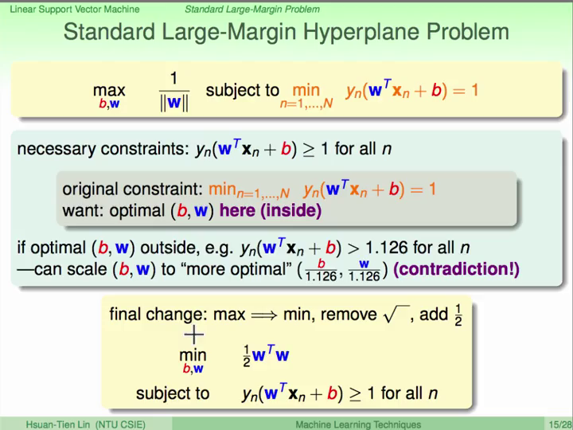

### 支持向量机

这种算法被称为 **支持向量机 (Support Vector Machine, SVM)**，是因为在超平面`边界`上的那些数据点决定了这个超平面和边界，而其他地方的数据点对于边界和超平面来说是不必要的。
这些在超平面边界上的点被称为 **支持向量**（的候选），因为这些点就好像在支撑着这个超平面一样。

```
####### 感受数学的力量吧！！！ #######
```

---

那么我们继续来求解这个问题，这个问题有一些特性：
- 这个问题是`凸的二次函数`
- 这个问题是 **w** 和 <i>b</i> 的`线性运算`

具有这种特性的问题被称为 **二次规划 (Quadratic Programming, QP)**，有很多现成的工具来求解这种问题，那么我们只要把这个问题转化成标准二次规划问题的形式就很好处理了。（作为“文科生”，这段转化忽略...）

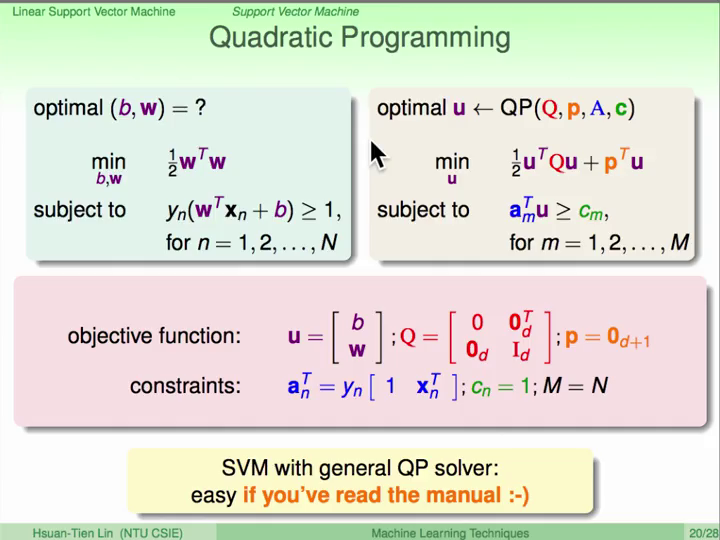

这就是硬边界（hard-margin，每个数据都是正确区分的）的线性（非线性变换后线性也可以）支持向量机的标准解法。

### 支持向量机的理论保证

首先我们来比较一下`正则化`（参见《基石》）和 SVM 在最小化和条件上的区别：

|                |              Minimize               |                 Constraint                 |
|:--------------:|:-----------------------------------:|:------------------------------------------:|
| Regularization |         <i>E</i><sub>in</sub>       | <b>w</b><sup><i>T</i></sup><b>w</b> &le; C |
|       SVM      | <b>w</b><sup><i>T</i></sup><b>w</b> |  <i>E</i><sub>in</sub> = 0 [and scaling]   |

所以 SVM 和正则化有些类似。

---

另外，我们再来讨论一下 SVM 的 `VC Dimension`（参见《基石》）。首先来讨论一下 `Dichotomy`（参见《基石》），当没有`边界`的时候，一个线性分类器在一些数据上可以 `Shatter`（参见《基石》）。

但是当我们加入了`边界`之后，在一些情况下可能就不能`Shatter`了，因为原先能够`Shatter`的分类器没有足够大的`边界`。这样就相当于减少了 `Dichotomy` 也就是减少了 `VC Dimension`，因此有更好的 `Generalization`。

这种方法相当于再数据层面增加了一些条件来控制`VC Dimension`。

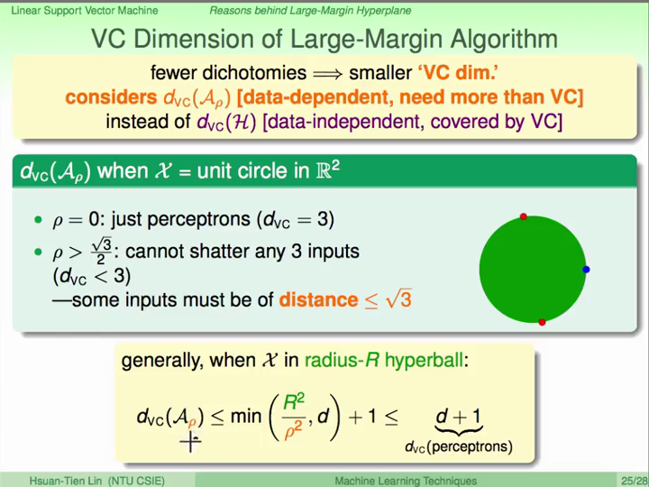

---
---
---

## Lecture 2: Dual Support Vector Machine

—— 介绍 SVM 的对偶问题

—— 介绍拉格朗日函数

### 回顾 SVM 和对偶问题（对偶 SVM）

在上面我们介绍了 SVM 的标准解法（转化成`二次规划`问题），并且我们可以利用`特征转换`把 **x** 转换到 **z** 空间中，这样在`VC`上我们就可以做到有很高的复杂度，但又因为`边界`限制而没有那么多的复杂度。

但是还有一个问题，因为 QP 有 <i>d</i>+1 个变量，当我们使用的特征转换很强大的时候，转换后的 <i>d</i> 就会很大，因此这个二次规划问题也很难解。我们希望解 SVM 的过程能够和  <i>d</i> 没关系，比如夸张到 <i>d</i> 无穷大也能解。

那么，下面我们就来将原来的 SVM 求解中的有 <i>d</i>+1 个变量和 N 个条件 的 QP，转换成它的 **对偶问题**，这新的问题只有 N 个变量和 N+1 个条件。这里将有很多很多的数学（之前的还不算多...），我们会只介绍概念和重点。

我们用到了一个很重要的工具就是 **拉格朗日乘数 Lagrange Multiplier**，它常用于解决有条件的最佳化问题。在《基石》中，我们在做`正则化`的时候就有用到，用它将正则化的条件放进最小化的问题中。

不一样的地方是，在正则化的时候，&lambda; 是限制条件常数 C 的一种代替，因此也是常数。而在 SVM 中，我们把 &lambda; 当做一个变量来代替原本 SVM 的变量来解，这就是它的 **对偶问题**。因为 SVM 有 N 个条件，所以就有 N 个 &lambda;。

---

[Issues #2] 什么是对偶问题？

---

原来的 SVM 问题：


我们构建一个 **拉格朗日函数** （其中的 &alpha;<sub>n</sub> 相当于 &lambda;<sub>n</sub>）：


这样一来有：


这是因为：
- 限制 &alpha; 大于等于 0
- 当条件不满足时，`条件项`大于 0，最大化拉格朗日函数会得到无穷大
- 当条件满足时，`条件项`小于等于 0，最大化拉格朗日函数等于`目标项`
- 对`目标项`最小化就等同于原来的 SVM 问题

### 拉格朗日对偶 SVM

在 SVM 的对偶问题中，对于某一个特定的 &alpha;<sup>'</sup>，拉格朗日函数的值必定小于等于最大的那一个：


对不等式右边取最大化，不等式仍然成立，因为使拉格朗日函数最大的那个 &alpha;<sup>'</sup> 也包含在任意一个中，所以我们也可以把 &alpha;<sup>'</sup> 看做是 &alpha;（这就是 **拉格朗日对偶问题**）：


这个拉格朗日对偶问题是 SVM 问题的`下限`（小于等于），下限是一个 **弱对偶关系**。如果等号成立的话（**强对偶关系**），我们就可以用右边的问题代替原来的 SVM（这样的好处是右边对 <i>b</i> 和 **w** 的最小化是没有条件的，很好解）。

如果这个问题是凸的、有解（线性可分）并且只有线性的限制条件，这个`强对偶关系`就成立，SVM 符合这些条件，等号成立（这里“文科生”了）。

---

下面来求解（化简）拉格朗日对偶问题：


因为`拉格朗日函数`的最小化没有条件，所以只要求导（偏微分导数）就可以了，拉格朗日函数是 <i>b</i> 、 **w** 和 &alpha; 的函数，我们先对 <i>b</i> 求偏微分：


既然最佳解满足这个偏微分导数为 0 的条件，我们可以把这个条件加进拉格朗日对偶问题中：


同时，因为 <i>b</i> 的系数为 0，因此 <i>b</i> 被去掉了。但是 <i>b</i> 在我们做预测的时候是有用的（需要计算），没关系，后面有办法再把 <i>b</i> 算出来。

那么我们继续对 **w** 求偏微分：


向量化表示：


继续带入：


现在这个问题就只是和 &alpha; 相关的最佳化问题，总结一下现在所有的条件（**KKT 条件**）：

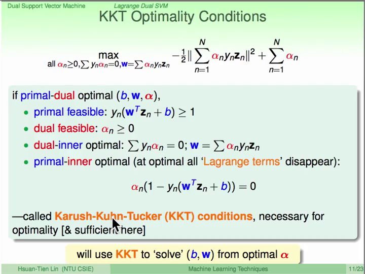

### 求解对偶 SVM

现在 SVM 问题被转化成了只和 &alpha; 相关的最佳化问题，我们再来做一些简化。首先我们通过取负把最大化问题转化成最小化问题：（因为我们现在只讨论 &alpha; 所以和 **w** 相关的条件可以不用处理）


这个最小化问题有 N 个变量（&alpha;）和 N+1 个条件！并且这个问题也是一个凸的二次规划问题！下面只要把这个问题转化成标准二次规划问题的形式就好了！

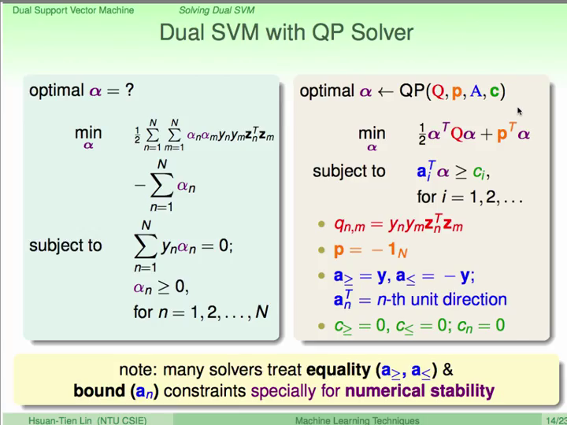

但是转化后的二次规划问题也不好解，因为这里有个巨大的非零矩阵 Q ，而且这个 Q 还需要先算出来，再放到求解二次规划的工具中，通常需要花费太长的计算时间。

同时，其实我们也没有真正的摆脱 <i>d</i>，因为当 <i>d</i> 很大的时候，计算 Q 仍然和 <i>d</i> 是有关的，这个我们在下一讲来处理。

实际上，通常有特别为 SVM 求解的二次规划工具，专门针对求解 SVM 做了优化，加速计算 Q 矩阵的过程。

---

当我们得到了 &alpha; 之后，我们需要用 KKT 条件来算出 <i>b</i> 和 **w**：


对于 <i>b</i>，如果 &alpha;<sub>n</sub> > 0，则可利用拉格朗日函数中的条件项也可以算出：


前面我们说过，在边界上的那些点是`支持向量的候选`，只有那些 &alpha;<sub>n</sub> > 0 的点才是真的 **支持向量**。

### SVM 其他的信息

既然那些 &alpha;<sub>n</sub> > 0 的点才是真的支持向量，那么在计算 **w** 的时候，只需要计算支持向量的那些项：


而 <i>b</i> 则可以用任意一个支持向量计算出来。

这和之前我们讲 SVM 的几何意义是相似的，只有支持向量有用，而其他的数据没有用。因此 SVM 也可以看成是一个找出支持向量的机制！

类似的，PLA 则是用“犯错误”的数据计算 **w** 算法：


这就很有意思了，这些算法都是数据的`线性组合`，也就说 **w** 可以用数据`表现` (represent) 出来。

---
---
---

## Lecture 3: Kernel Support Vector Machine

—— 介绍核函数的概念

—— 介绍不同的核函数和其特点

### 核函数

在我们利用对偶问题和二次规划求解 SVM 的时候，还剩下一个问题就是 Q 矩阵的计算是依赖于 <i>d</i> 的：


这里面最关键的计算就是是先做`特征转换`再做`內积`，导致计算很复杂。那如果我们可以先做`內积`再做`特征转换` **也许** 就可以避开复杂的计算。

先用一个二项式的特征转换来看一下：

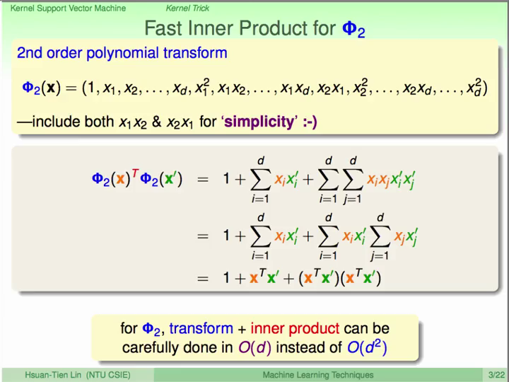

果然，在这个例子上可以减少计算复杂度。

我们把这个`特征转换`和`內积`的函数叫做 **核函数 (kernel function)**。

这样一来，刚才说的 Q 矩阵可以用核函数来节约计算：


不仅如此，还有很多东西都可以用核函数来节约计算，比如 <i>b</i>：


还有做预测的时候：


通过`核函数`，我们其实没有任何一次是在特征转换后的 **z** 空间做运算，这样我们也就真正意义上的摆脱了特征转换的复杂度 <i>d</i> ，只需要 **x** 就可以！这就是 **Kernel SVM** ！

---

### 多项式核函数

刚才我们看了一下二项式转换和相对应的核函数，如果我们对二次项做一个缩放，一次项再做一个根号二倍的缩放，就可以得到一个简单的、一般形式的 **二项式核函数** 的表现形式。

0}"/>

这个一般形式的核函数和原本的二项式核函数有什么区别呢？

它们对应到同一个二次空间，因为都是二次的特征转换；但是因为系数不同，尤其是在 **x** 的`內积`
上，在`几何`上定义了不同的`距离`，因此会得到不同的`边界`：

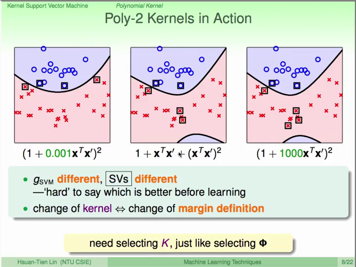

把二项式核函数进一步扩展下去，就可以得到 **多项式核函数** 的一般形式：

0,\zeta\,\ge\,0}"/>

利用核函数，我们可以很方便的使用很高次的特征转换而不用花费太多的计算；同时利用边界，可以控制函数的复杂度，帮助我们不会过拟合。

当然，还有最简单的 **线性核函数** （略）。

### 高斯核函数

既然我们可以用核函数摆脱特征转换 <i>d</i> 的限制，也节省了很多计算，那么我们是不是可以疯狂的把特征转换扩展，甚至扩展到 **无限多** 的维度上？

为了简化这个问题，我们现在假设输入 **x** 只有一维。然后我们构建一个简单的高斯函数，并来证明这个高斯函数相当于是在无限多维上的特征转换！


这里的：


通过泰勒展开，高斯函数里可以藏着一个无限多维特征转换的核函数 **高斯核函数**！是不是很神奇！

更一般化一点的：

0}"/>

当我们预测的时候：


这相当于是很多以`支持向量`为中心的`高斯函数`进行`线性组合`，因此这个核函数又叫 **径向基核函数 (Radial Basis Function, RBF)**。

不过，尽管 SVM 有`核函数`帮助我们省掉了很多计算复杂度，有`边界`帮助我们控制复杂度，但在这个强大的`特征转换`下，仍然有可能会`过拟合`！所以一定要慎重选择参数。

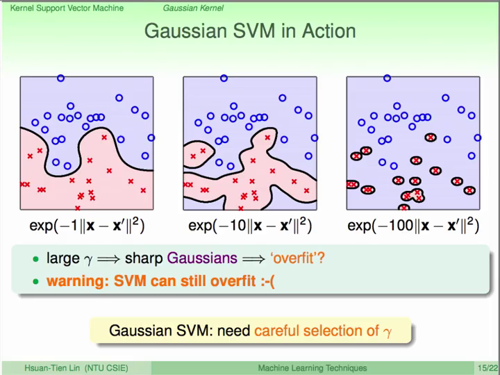

### 核函数的比较

下面我们来总结比较一下这几个核函数的优点和缺点：

- 线性核函数
    - 简单，快速（不需要转换成对偶问题），可解释的
    - 存在线性可分的限制
- 多项式核函数
    - 比线性更强，可以根据对问题的理解控制多项式系数（通常比较小的 Q ）
    - 计算比较困难（数值范围比较大），需要调整的参数多
- 高斯/径向基核函数
    - 超级强大，容易计算，参数简单
    - 过拟合风险，模型难以解释

其实还有其他的核函数，核函数的几何意义是两个向量的內积（相似性），那么是不是任意某个`相似性`的表示都可以作为核函数呢？不是的。因为核函数还有一些特性的要求（充分必要条件）：
- 对称性
- <i>K</i> 矩阵是半正定的

不过“创造”一个新的核函数还是很难的。

---
---
---

## Lecture 4: Soft-Margin Support Vector Machine

—— 介绍软边界的支持向量机（也就是一般所说的SVM）

### 软边界的意义

上面我们介绍了硬边界的 SVM，它要求数据必须是完全正确区分的。然而实际上这个条件会引发很多问题，比如数据有噪音，追求完全正确区分不一定有意义；而且能够完全正确区分意味着可以`Shatter`，复杂度会偏高；这些在实际应用中反而会容易造成过拟合。

因此，实际应用中我们应该能够容忍一些噪音。在《基石》中，我们讲过一个`口袋算法`，使分类器在数据集中出现的错误最少，我们也可以把它运用在 SVM 上：


这里 的 C 是可以用来调节（权衡）`边界`和`噪音容忍程度`的参数。

---

但是，这样一来这个问题就不是一个 QP 问题了，因此之前我们做的所有努力就都不能用了。除此以外，小和大的错误没有区分，显然这也是不好的。

因此我们提出一个新的参数：“**边界违背程度**” <b>&xi;</b>，用这个参数来代替错误的个数来表示错误，这就是软边界的 SVM：


这是一个有 <i>d</i>+1+N 个变量和 2N 个条件 的 QP，我们接下来就可以用和前面硬边界 SVM 类似的方法来解决它。

### 对偶问题

既然现在我们的问题和硬边界 SVM 是类似的 QP 问题，那么解决的方法也是类似的。

我们先构建一个`拉格朗日函数`来化解这个问题：


然后转化成`拉格朗日对偶问题`：


求导：


这个新的条件就可以帮助我们简化，带入之后神奇的消掉了 <b>&xi;</b>（和之前消掉 <i>b</i> 类似），于是得到：


除了 &alpha;<sub>n</sub> 多了一个上限是 C 的条件以外，其他和之前的 SVM 一样！因此之前的所有努力都可以继续用到这个新的 SVM 上来。

### 其他的信息

软边界 SVM 和硬边界 SVM 只有一点点区别 （上限是 C），利用 KKT 条件计算的时候有一点区别：

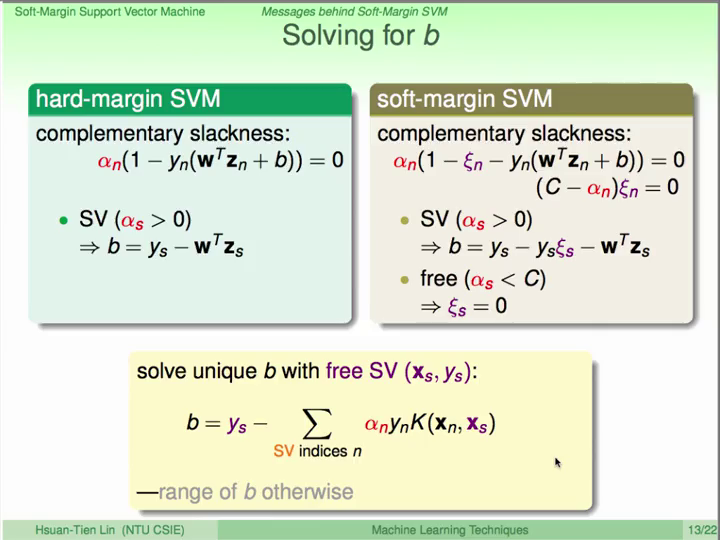

这种在上限 C 以下的支持向量（SV）叫做 free SV。这样一来软边界的 SVM 把数据分成了三类：
1. non-SV (&alpha; = 0, &xi;<sub>n</sub> = 0)，距离边界很远的点，对找到超平面没有影响；
2. free-SV (0 < &alpha;<sub>n</sub> < C, &xi;<sub>n</sub> = 0)，在边界上的点；
3. 边界内的点 (&alpha;<sub>n</sub> = C, &xi;<sub>n</sub> = 边界违背程度)；

利用这个数据分类，可以帮助我们分析数据，到底哪些是有问题的分类，哪些是噪音等。

不过需要注意的是，当 C 越大，软边界的 SVM 和硬边界的 SVM 就越像（边界上的容忍很低），因此也是有可能过拟合的！

### 模型选择

最常用的 SVM 模型是软边界、高斯核函数的 SVM，因此有很多参数需要选择。最好用的方法就是利用`Cross Validation（CV，交叉验证）`（参见《基石》）。

在 SVM 上有一个有意思的结论：对于 Leave-One-Out CV ，有 <i>E</i><sub>loocv</sub> &le; #SV / N。

这是因为在 Leave-One-Out 的时候，如果数据是 non-SV，那么模型不受到影响，并且 error = 0 ；如果数据是 SV，那么 error &le; 1。这也是 non-SV 对模型没有任何影响的一种表示。

因此我们也可以用 SV 的个数来做模型选择，不过需要注意的是，SV 的个数只是上限，不代表是最优的，通常只是用来排除那些不好的模型。

---
---
---

## Lecture 5: Kernel Logistic Regression

—— 介绍核函数逻辑回归

### 软边界 SVM 是一种正则化

对于软边界的 SVM，我们可以把`边界违背程度`的条件带入公式：


这个公式就有点儿像我们在做正则化，一个 **w** 的限制项加上一个错误项，但是我们没有这么继续做下去是因为这不是 QP 问题，不能使用核函数，而且 max 不能微分不好解。

不过这样看来 SVM 和正则化的关系更近了，那么我们能不能把 SVM 的解决思路延伸到其他的问题上？

### SVM 回归算法

我们先来看看这种形式的软边界 SVM，后面一项可以看做一种`错误的衡量`。

和 0/1 error 相比，SVM error （又叫 hinge error）是它的上限。
类似的，逻辑回归的 cross-entropy error 也是 0/1 error 的上限。
这两个 error 是很相似的，因此 SVM 也可以看成是 `L2 正则化`的逻辑回归。

- err<sub>0/1</sub> = [[ys &le; 0]]
- err<sub>SVM</sub> = max(1-ys,0)
- err<sub>SCE</sub> = log<sub>2</sub>(1+exp(-ys))

那么到底能否把 SVM 当做是逻辑回归？或者帮助解决逻辑回归呢？

### SVM soft 二分类

使用 SVM 帮助解决逻辑回归有几种思路：
1. 直接使用 SVM 作为逻辑回归的近似解（直接加 <i>&theta;</i>），但是这样无法享受逻辑回归的好处；
2. 用 SVM 的解作为起始点，再做逻辑回归，但这样麻烦/没必要，不如直接逻辑回归，相当于没有享受 SVM 的好处；

因此，为了融合 SVM 和 逻辑回归，考虑在 SVM 得到的解上做一个 **缩放** 和 **平移**，然后再做逻辑回归，当 SVM 得到很好的解，那么缩放 A > 0，而平移 B &approx; 0：


这样相当于用 SVM 做`特征转换`，然后用逻辑回归做微调，新的逻辑回归问题是：


### 核逻辑回归（Kernel Logistic Regression）

上面的这种方式看起来就很麻烦，而且逻辑回归也不是一个二次规划问题，那还能怎么直接利用 SVM 的好处（比如核函数）呢？

SVM 能够使用核函数的关键在于把 **z** 的內积换成 **x** 的运算，如果 **w** 是 **z** 的线性组合，那么就可以用核函数！

在 SVM、PLA 甚至是 SGD 逻辑回归中， **w** 都是 **z** 的线性组合，只要最佳的 **w** 可以用 **z** 的线性组合`表示`，那么就有可能用核函数简化！

其实，任何 L2 正则化的`线性模型`中最优 **w** 都可以用 **z** 的线性组合表示：


我们可以把 **w** 拆分成垂直和平行于 **z** 的两个部分，我们希望垂直项是 **0**：


如果最佳解的垂直项不是 **0**，对于后面的错误项，**w** 和 **z** 相乘，垂直项没有影响，而对于前面这一项：

\mathbf{w}_{\|}^T\mathbf{w}_{\|}}"/>

平行项是更小更好的解，出现矛盾！所以最佳解的垂直项是 **0**！

任何 L2 正则化的线性模型中的最佳解 **w** 都可以用 **z** 的线性组合，这个叫做 **Representer Theorem**。

因此很多这种问题都可以用核函数简化！

---

那么对于 L2 正则化的逻辑回归：


将最优解 **w** = &sum; &beta;<sub>n</sub><b>z</b><sub>n</sub> 带入：


然后用 SGD 求解就好了，这就是 **核逻辑回归（KLR）**。不过和 SVM 不一样的是，&beta; 通常都不是 0。

这个公式也可以看成是 **x** 在 <i>K</i> 上做`特征转换`之后和 &beta; 相乘，加上 &beta; 和 &beta; 相乘 再乘以 <i>K</i>。

因此也可以看成是 &beta; 的线性模型：数据经过 <i>K</i> 特征转换，并且用 <i>K</i> 做正则化。

---
---
---

## Lecture 6: Support Vector Regression

—— 介绍 Support Vector Regression (SVR) 的概念和推导过程

—— 介绍 Kernel 在回归中的使用

—— 总结 SVM 和 Kernel 模型

### 核岭回归（Kernel Ridge Regression）

在上面我们利用 `Representer Theorem` 优化了逻辑回归的问题，那么我们来看一下线性回归能否也用类似的方法优化。线性回归类似的形式是 `ridge regression`：


最优解 **w** = &sum; &beta;<sub>n</sub><b>z</b><sub>n</sub> 带入：


向量表示：


化简：


求导：


所以有：


这个解是可能的，因为 **K** 是半正定的，且 &lambda; > 0。

这样我们就可以用核函数来做回归，不过这个需要 <i>O</i>(<i>N</i><sup>3</sup>) 的复杂度，而且 **K** 矩阵是稠密的。

当我们用核岭回归来做分类时，又称为 **Least-Squares SVM (LSSVM)**。

不过，核岭回归和核逻辑回归有一个问题是类似的，就是 &beta; 通常都不是 0，因此 SV 有很多，计算起来也比较很慢。那我们有没有办法可以让 &beta; 和 SVM 的 &alpha; 类似，更稀疏一些呢？

### Support Vector Regression (SVR) 的原始问题

考虑一个带有中立区的问题（tube regression），当错误比较小的时候，忽略错误；当错误比较大的时候，计算错误和中立区的距离：

- |s-y| &le; &epsilon;: 0
- |s-y| > &epsilon;: |s-y|-&epsilon;

也就是：err(y,s) = max( 0,|s-y|-&epsilon; )

和前面普通的线性回归（ err(y,s) = (s-y)<sup>2</sup> ）相比，在错误很小的时候 tube regression 的错误和线性回归是非常接近的。而当错误很大的时候 tube regression 的错误会小很多，这样有可能是好事，因为这样对噪音的容忍会多一些。

下面我们就用 L2 正则化的 tube regression，来得到稀疏的 &beta;。因为这个 loss 和 SVM hinge error 是类似的。


这个和 SVM 有点儿像，我们可以先把它变成一个 QP 然后再用 KKT 条件得到稀疏。那我们先把这个公式写成更像 SVM 的形式：


在我们处理 SVM 的时候引入了边界违背程度来去掉 max，这里我们也这样操作：


由于这个公式有取绝对值，也不是 QP，因此把绝对值拆成两项：


这就是 **Support Vector Regression (SVR)** 的原始问题（primal）。它是一个有 <i>d</i>+1+2N 个变量和 4N 个条件 的 QP。

### Support Vector Regression (SVR) 的对偶问题

有了 SVR 的原始问题，接下来就是转化成对偶问题，加入拉格朗日乘数，拉格朗日函数，拉格朗日对偶，求导这一系列的化简就好了，这里就不再赘述了。需要特别注意的几点是：

- 有两个拉格朗日乘数
    - 
    - 
- 最优解的 KKT 条件
    - 
    - 
    - 
    - 

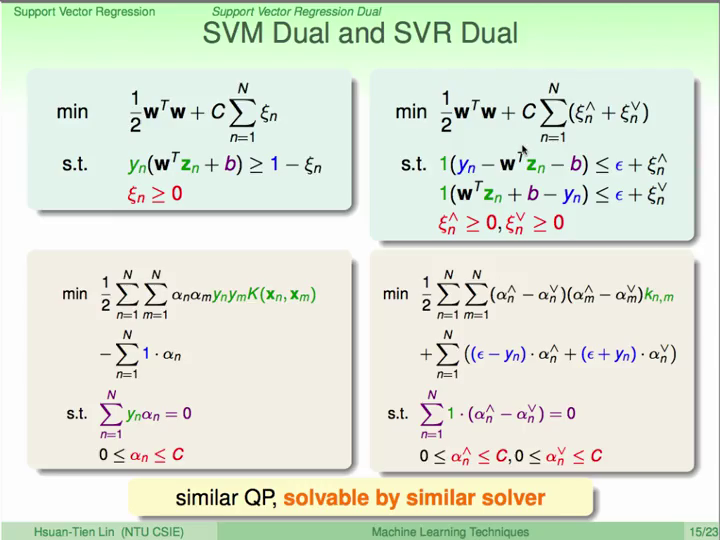

对于那些落在 tube 里面的点，&beta; = 0，从而减少了 SV。

### SVM 总结

总结一下我们目前学过的模型：

在《基石》中：
- PLA/Pocket
- linear ridge regression
- logistic regression

SVM 相关的线性模型：
- linear soft margin SVM
- linear SVR

Kernel 相关：
- SVM
- kernel ridge regression -> SVR
- kernel logistic regression -> probabilistic SVM

---
---
---

## Lecture 7: Blending and Bagging

—— 介绍基础的模型混合的方法

### Aggregation

对于一个分类问题，如果你有很多个模型（<i>g</i><sub>1</sub>,...,<i>g</i><sub><i>T</i></sub>），那么你要怎么选择这些模型？有几种策略：

- 用 validation 选出（select）表现最好的那一个（之前我们用的是这个策略）


- 让这些模型`投票`，最后综合（mix）做出结果！（当然也可以有不同的`投票`权重）


- 根据在不同的条件下，选用不同的模型（combine）


这三种策略后面的是包含前面的，最后这个模型就叫做 Aggregation 模型。

第一种`选择`的方式，很简单也很普遍，但是它很依赖于模型的强度，只有一个很强的模型才能保证有很好的效果。

那么对于 Aggregation，我们能否利用很多个不那么强的模型，群策群力做到好的结果呢？

---

先来看两个例子：

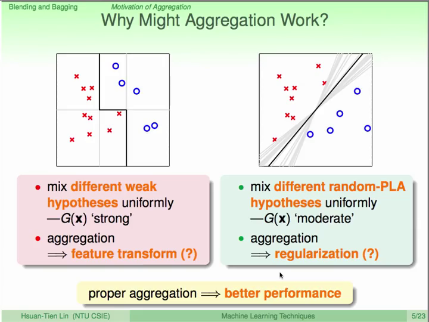

### Blending

我们要介绍的第一个策略就是 Blending （混合），也就是投票的策略。

对于二元分类问题：


对于多元分类问题：


对于回归问题：


对于这些例子，当 <i>g</i><sub>t</sub> 全都一样的时候，结果和用一个 <i>g</i><sub>t</sub> 是一样的。
但当 <i>g</i><sub>t</sub> 很不一样的时候，**多数** 或者 **平均** 就有可能比原来的 **一个** 能得到更好的结果。

我们以回归问题来证明一下（省略 **x** ）：


也就是说，对所有 <i>g</i><sub>t</sub> 错误的平均，等于 G 的错误加上 <i>g</i><sub>t</sub> 和 G 的差距（错误）的平均。

如果不是对于所有的数据 **x** ，而是所有可能产生的数据，左边就是 <i>E</i><sub>out</sub>：


也就是说，随机选 <i>g</i><sub>t</sub> 错误的平均，比 G 的错误要大。

---

如果我们把所有 **数据** 分份，每次 _N_ 个数据，用 **算法** 从这个数据中得到 <i>g</i><sub>t</sub>，我们重复 _T_ 次，当 _T_ 趋于 **无限大** 时：


带入：


Blending 方法能够减少前面的这一项，因此算法的表现可以提高。

### Linear Blending

下面介绍一下不同权重的投票，也就是 **Linear Blending**，相当于多个 <i>g</i><sub>t</sub> 进行线性组合，因此我们的问题变成：


这个问题很像是`带特征转换的线性回归`，只有一个小区别就是 &alpha; &ge; 0，后面我们再来解释：


这也和我们之前在 SVM 讲过的 two-level learning 策略类似（先训练 SVM 再用逻辑回归），这里先训练一些 <i>g</i><sub>t</sub> 模型，再线性回归。

也可以看成是 **线性模型** 加上 <b><i>g</i><sub>t</sub></b> **作为特征转换** 再加上 **条件**（&alpha; &ge; 0）。

但是，实际上我们通常会忽略这个 **条件**，因为：


也就是说对于 &alpha; &lt; 0 的 <i>g</i><sub>t</sub>，只要反过来使用这个模型就好了。

---

Linear Blending 和 `模型选择` 很像，也扩大了模型的复杂度，会付出所有模型的复杂度加在一起的代价，甚至还会更高，因此在实际操作中我们一般不用 <i>E</i><sub>in</sub> 来选择 &alpha;，而是用 <i>E</i><sub>val</sub>。

总结一下实际上的操作流程：
1. 用训练数据得到一些模型 
2. 将这些模型作为特征转换 
3. 转换验证数据 
4. 计算 &alpha;
5. 用 &alpha; 和 **全部数据** 计算的 <i>g</i><sub>t</sub> 得到 G。

这个先用 <i>g</i><sup>-</sup><sub>t</sub> 然后再用 <i>g</i><sub>t</sub> 的技巧在实际运用中能够有很大的提高！

如果不是 Linear 模型做 Blending 就叫做 **Stacking**，但是要注意不要过拟合。

### Bagging (Bootstrap Aggregation)

前面介绍的 Blending 是先得到一些 <i>g</i><sub>t</sub> 再集合起来，那么这些 **不一样的** <i>g</i><sub>t</sub> 是怎么得到的？

- 来自不同的模型
- 同一个模型不同的参数
- 算法随机性的不同
- 数据随机性的不同

下面介绍的这种是用同一组数据得到不同的 <i>g</i><sub>t</sub>。

前面我们说理想中的 Blending 的时候，用无限多的数据（分成无限多份 **新鲜的** 数据）和无限多的 <i>g</i><sub>t</sub> 消除了算法中的 variance。
但是在实际运用中，不可能有无限多的数据。因此，我们用比较多的 <i>g</i><sub>t</sub> 和有限的数据来做，这就用到了统计中的工具 **Bootstrapping** 来模拟产生无限多的“真实的”数据。

每次从数据集中取出 _N_ 组数据，然后放回（Sampling with replacement），重复这个过程很多次就可以产生模拟无限多的数据。

用这种方法做的 Aggregation 就叫做 Bootstrap Aggregation，也叫 **Bagging**。
这种方法对于对`数据随机性`很敏感的算法会很有效。

---
---
---

## Lecture 8: Adaptive Boosting


<!--  -->
